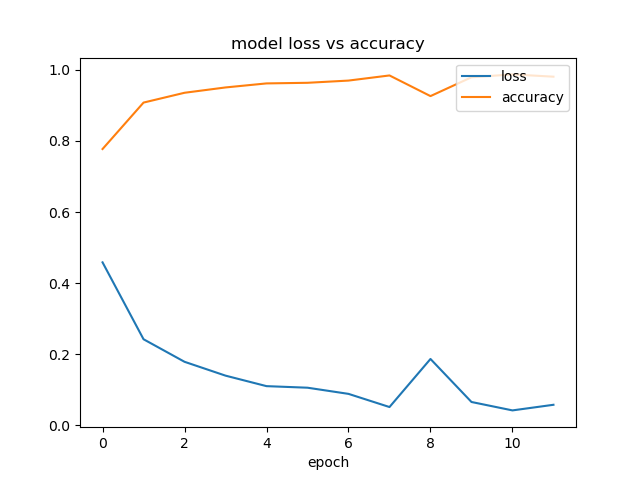
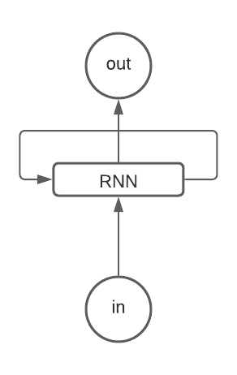
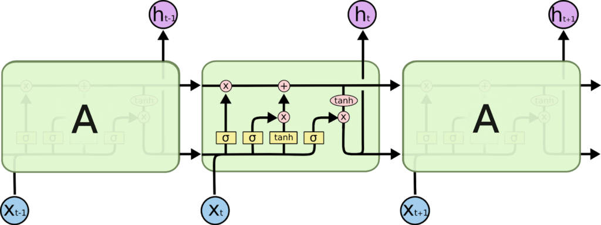
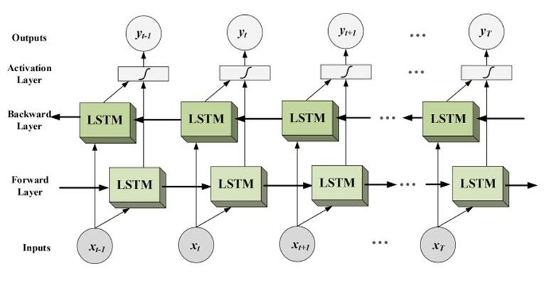

# Text classification on IMDB dataset using Keras and Bi-LSTM

Text classification on IMDB dataset using Keras and Bi-LSTM network.

### Usage

```shell
python3 main.py
```

### Hyper Parameter

Epoch: 12<br>
Batch size: 128<br>
Dropout: 0.5<br>

### Model Accuracy

Loss: 0.0574<br>
Accuracy: 0.9809<br>
Validation Loss: 0.6073<br>
Validation Accuracy: 0.8534<br>



## Terminology

### Recurrent Neural Network

Recurrent neural networks (RNN) is a type of neural network that uses previous information during model training. It remember the sequence of the data and use data patterns to give the prediction.

RNN uses feedback loops which makes it different from other neural networks. Those loops help RNN to process the sequence of the data. This loop allows the data to be shared to different nodes and
predictions according to the gathered information. This process can be called memory.

RNN and the loops create the networks that allow RNN to share information, and also, the loop structure allows the neural network to take the sequence of input data. RNN converts an independent
variable to a dependent variable for its next layer.



### Long Short Term Memory

Long short term memory networks (LSTM) are a special kind of RNN. They were introduced to avoid the long-term dependency problem. In regular RNN, the problem frequently occurs when connecting previous
information to new information. If RNN could do this, they’d be very useful. This problem is called long-term dependency.

The repeating module in a standard RNN contains a single layer. To remember the information for long periods in the default behaviour of the LSTM. LSTM networks have a similar structure to the RNN,
but the memory module or repeating module has a different LSTM. The block diagram of the repeating module will look like the image below.



### Bi-Directional Long Short Term Memory

Bidirectional long-short term memory (Bi-LSTM) is the process of making any neural network o have the sequence information in both directions backwards (future to past) or forward (past to future).

In bidirectional, our input flows in two directions, making a Bi-LSTM different from the regular LSTM. With the regular LSTM, we can make input flow in one direction, either backwards or forward.
However, in bidirectional, we can make the input flow in both directions to preserve the future and the past information. For a better explanation, let’s have an example.

In the sentence "boys go to…" we can not fill the blank space. Still, when we have a future sentence “boys come out of school”, we can easily predict the past blank space the similar thing we want to
perform by our model and bidirectional LSTM allows the neural network to perform this.


